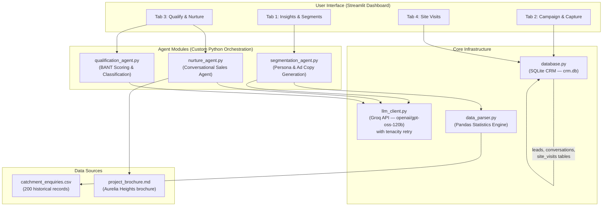

# System Architecture: AI-Powered Real Estate Lead Generation & Site Visit Conversion Agent

## 1. Overview

This document describes the architecture of an agentic AI system built for a real estate developer launching **Aurelia Heights**, a new residential project by Sunrise Estates Pvt. Ltd. in the Whitefield–Hoodi belt, Bengaluru (Catchment A). The system manages the complete lead journey — from understanding buyer preferences using historical CRM data to converting qualified leads into confirmed site visits.

**Project Context (Aurelia Heights):**
* 620 apartments across 4 towers (G+18), 2 BHK & 3 BHK configurations
* Price range: ₹82 Lakh – ₹1.52 Cr (all inclusive)
* Possession: December 2028 | RERA Registered
* Key catchment: IT professionals, first-time buyers near ITPL / EPIP Zone / Hoodi Metro

---

## 2. High-Level Architecture Diagram



---

## 3. System Components

### 3.1. User Interface — Streamlit Dashboard (`app.py`)

A single-page Streamlit application with four tabs mapping directly to the funnel stages defined in the problem statement:

| Tab | Funnel Stage | Functionality |
|-----|-------------|---------------|
| **Insights & Segments** | Understand + Identify | Displays pre-computed pandas statistics (profession %, budget buckets, config split, timeline split, source split). Triggers LLM to generate 3–5 buyer personas and platform-specific ad copy. |
| **Campaign & Capture** | Action + Capture | Simulated lead capture form (name, phone, email, source, profession, budget). Phone-based deduplication on submit. Stores unified lead records in SQLite CRM. |
| **Qualify & Nurture** | Qualify + Nurture | Live chat interface with the AI sales agent. The agent answers questions using `project_brochure.md` context (injected into system prompt). After every message, the qualification agent extracts BANT and updates the live intent score (0–100) and Hot/Warm/Cold category. |
| **Site Visits** | Schedule | Date/time slot booking for selected leads. Confirmed visits table with lead name, phone, scheduled time, and status. |

### 3.2. Agent Modules (Custom Python Orchestration — No LangChain)

Each agent is a standalone Python module that composes prompts and calls the LLM client directly.

#### 3.2.1. Segmentation Agent (`segmentation_agent.py`)
* **Input:** Pre-computed statistics from `data_parser.py` (percentage shares for profession, budget distribution in 3 buckets: <90L / 90–115L / 115L+, mean/median budget, config split, timeline split, source split)
* **System Prompt:** Instructed to use ONLY the numbers provided — no calculating, converting, or inventing statistics. Focus is on interpretation and marketing implications.
* **Output:** 3–5 buyer personas with platform-specific targeting parameters (Meta, LinkedIn, Google) and segment-specific ad copy.

#### 3.2.2. Nurture Agent (`nurture_agent.py`)
* **Input:** User's chat message + conversation history
* **Knowledge Injection:** Full `project_brochure.md` loaded into the system prompt at runtime (no Vector DB / no RAG). This includes Aurelia Heights configurations, pricing (₹82L–₹1.52 Cr), payment plan (₹2L booking, construction-linked), 28,000 sq ft clubhouse amenities, location advantages (1.8 km to Hoodi Metro, 4.5 km to ITPL), FAQs, and contact details.
* **Output:** Conversational response grounded in brochure facts. Does not fabricate information.

#### 3.2.3. Qualification Agent (`qualification_agent.py`)
* **Input:** Full conversation history as text
* **Output:** Structured JSON with BANT fields (`budget`, `authority`, `need`, `timeline`), `score` (0–100), and `category` (Hot/Warm/Cold)
* **Behavior:** Runs silently after every chat message to update the lead's score in real time.

### 3.3. Core Infrastructure

#### 3.3.1. LLM Client (`llm_client.py`)
* **Provider:** Groq API (cloud-hosted inference)
* **Model:** `openai/gpt-oss-120b`
* **SDK:** `groq` Python SDK
* **Retry Strategy:** `tenacity` with random exponential backoff (1–10s), max 5 attempts — handles rate limits on free-tier API keys
* **Configuration:** API key loaded from `.env` via `python-dotenv`

#### 3.3.2. Data Parser (`data_parser.py`)
* **Input:** `catchment_enquiries.csv` (200 records)
* **Pre-computed Statistics (Pandas):**
  * Profession percentage split (all professions)
  * Budget distribution: mean, median, and 3-bucket breakdown (<90L, 90–115L, 115L+) with percentages
  * Configuration interest percentage split
  * Timeline percentage split
  * Enquiry source percentage split
* **Design Decision:** All math is done in pandas before the LLM prompt. The LLM is explicitly forbidden from performing its own calculations.

#### 3.3.3. Database (`database.py`)
* **Engine:** SQLite (`crm.db`)
* **Schema:**

| Table | Key Columns | Purpose |
|-------|------------|---------|
| `leads` | id, name, phone (UNIQUE), email, source, profession, budget_min, budget_max, intent_score, category, created_at | Central lead store with phone-based deduplication |
| `conversations` | id, lead_id (FK), role, content, timestamp | Full chat history per lead |
| `site_visits` | id, lead_id (FK), scheduled_time, status | Visit bookings with status tracking |

---

## 4. Data Flow (The Lead Journey)

```mermaid
flowchart LR
    subgraph "1. Understand"
        A1["catchment_enquiries.csv\n(200 records)"] --> A2["data_parser.py\n(Pandas statistics)"]
    end
    subgraph "2. Identify & Target"
        A2 --> A3["segmentation_agent.py\n+ Groq LLM"]
        A3 --> A4["3-5 Buyer Personas\n+ Ad Copy"]
    end
    subgraph "3. Action & Capture"
        A4 -.-> A5["Simulated Lead Form\n(Streamlit Tab 2)"]
        A5 --> A6["database.py\n(Phone Dedupe → SQLite)"]
    end
    subgraph "4. Qualify & Nurture"
        A6 --> A7["nurture_agent.py\n(Chat with brochure context)"]
        A7 --> A8["qualification_agent.py\n(BANT → Score 0-100)"]
        A8 --> A9["Hot / Warm / Cold"]
    end
    subgraph "5. Convert"
        A9 --> A10["Site Visit Booking\n(Streamlit Tab 4)"]
        A10 --> A11["Confirmed Visit\nin SQLite"]
    end
```



### Step-by-Step Flow:

1. **Understand:** `data_parser.py` loads `catchment_enquiries.csv`, computes percentage splits for profession, budget (3 buckets), config, timeline, and source using pandas.
2. **Identify & Target:** `segmentation_agent.py` sends these pre-computed stats to the Groq LLM, which generates 3–5 buyer personas with Meta/LinkedIn/Google targeting parameters and ad copy.
3. **Action & Capture:** User fills out the simulated lead form in Tab 2. `database.py` validates and deduplicates by phone number, stores in the `leads` table with source attribution.
4. **Qualify & Nurture:** In Tab 3, the user chats with the AI sales agent. `nurture_agent.py` answers questions using `project_brochure.md` (Aurelia Heights details injected in system prompt). After each message, `qualification_agent.py` silently analyzes the full conversation, extracts BANT signals, and updates the lead's intent score and Hot/Warm/Cold category in SQLite.
5. **Convert:** In Tab 4, the user books a site visit for a qualified lead. The visit is logged in the `site_visits` table with date, time, and status.

---

## 5. Technology Stack

| Layer | Technology | Purpose |
|-------|-----------|---------|
| LLM Provider | Groq API | Fast cloud inference |
| LLM Model | `openai/gpt-oss-120b` | Chat completions for all agents |
| LLM SDK | `groq` Python SDK | API client |
| Retry | `tenacity` | Exponential backoff for rate limits |
| UI Framework | Streamlit | Interactive 4-tab dashboard |
| Database | SQLite (`crm.db`) | CRM lead store, conversations, visits |
| Data Analysis | Pandas | Pre-compute all statistics before LLM |
| Config | `python-dotenv` | Load `GROQ_API_KEY` from `.env` |
| Knowledge Base | System prompt injection | Full brochure in prompt (no Vector DB) |
| Orchestration | Custom Python modules | One module per agent, no framework |

---

## 6. File Structure

```
Potential buyer/
├── .env                        # GROQ_API_KEY
├── app.py                      # Streamlit UI (4 tabs)
├── llm_client.py               # Groq API wrapper with retries
├── data_parser.py              # Pandas statistics engine
├── database.py                 # SQLite CRM schema & operations
├── segmentation_agent.py       # Persona & ad copy generation
├── nurture_agent.py            # Conversational sales agent
├── qualification_agent.py      # BANT scoring & classification
├── catchment_enquiries.csv     # 200 historical enquiry records
├── project_brochure.md         # Aurelia Heights brochure (knowledge base)
├── crm.db                      # SQLite database (runtime)
└── document/
    ├── problem_statement.md    # Original requirements
    ├── architecture.md         # This file
    └── implementation_plan.md  # Implementation plan
```

---

## 7. Key Design Decisions

| Decision | Rationale |
|----------|-----------|
| **No Vector DB / No RAG** | The `project_brochure.md` is small enough (~4 KB) to fit entirely in the system prompt. This eliminates retrieval latency, chunking errors, and infrastructure complexity. |
| **No LangChain / LlamaIndex** | Custom Python modules provide full control, simpler debugging, and zero framework lock-in. Each agent is a plain function composing messages and calling the Groq SDK. |
| **Pre-computed statistics in Pandas** | LLMs are unreliable at arithmetic. All percentage splits, means, medians, and bucket distributions are computed in pandas and passed as facts. The LLM is instructed to only interpret, never calculate. |
| **Phone-based deduplication** | The `phone` column in the `leads` table has a UNIQUE constraint. Duplicate submissions (e.g., same person from Facebook and Google ads) are caught at the database level. |
| **Background BANT scoring** | The qualification agent runs silently after every chat message, extracting BANT from the full conversation history. The user sees the score update in real time without manual triggers. |

---

## 8. Scope & Limitations (POC)

* **Single catchment:** Designed for Catchment A (Whitefield–Hoodi, Bengaluru). Reusable for other catchments by swapping CSV and brochure.
* **Simulated campaigns:** Ad platforms (Meta, Google, LinkedIn) are simulated via the lead capture form. Production would integrate real APIs.
* **No WhatsApp integration:** Chat is via Streamlit UI. Production would connect to WhatsApp Business API.
* **No calendar integration:** Site visits are booked in SQLite. Production would integrate with Google Calendar / Calendly.
* **Journey ends at confirmed visit:** Negotiation, pricing discussion, and sale closure are out of scope.
