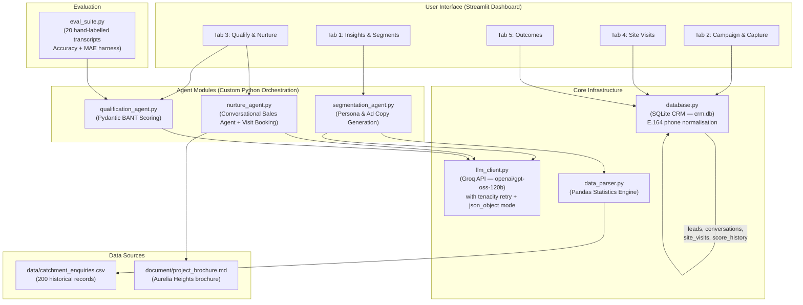
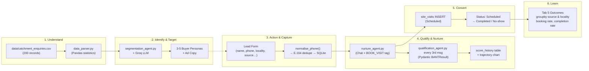

# System Architecture: AI-Powered Real Estate Lead Generation & Site Visit Conversion Agent

## 1. Overview

This document describes the architecture of an agentic AI system built for a real estate developer launching **Aurelia Heights**, a new residential project by Sunrise Estates Pvt. Ltd. in the Whitefield–Hoodi belt, Bengaluru (Catchment A). The system manages the complete lead journey — from understanding buyer preferences using historical CRM data to converting qualified leads into confirmed site visits and measuring outcomes.

**Project Context (Aurelia Heights):**
* 620 apartments across 4 towers (G+18), 2 BHK & 3 BHK configurations
* Price range: ₹82 Lakh – ₹1.52 Cr (all inclusive)
* Possession: December 2028 | RERA Registered
* Key catchment: IT professionals, first-time buyers near ITPL / EPIP Zone / Hoodi Metro

---

## 2. High-Level Architecture Diagram



---

## 3. System Components

### 3.1. User Interface — Streamlit Dashboard (`app.py`)

A single-page Streamlit application with **five tabs** mapping directly to the funnel stages:

| Tab | Funnel Stage | Functionality |
|-----|-------------|---------------|
| **Insights & Segments** | Understand + Identify | Displays pre-computed pandas statistics. Triggers LLM to generate 3–5 buyer personas and platform-specific ad copy. |
| **Campaign & Capture** | Action + Capture | Lead capture form with `locality` selectbox (8 fixed catchment options), source, profession, budget. Phone E.164 normalisation on submit. |
| **Qualify & Nurture** | Qualify + Nurture | Live chat with AI agent. BANT qualification runs every **3rd user message** (not every message). Score trajectory line chart. Chat-based site visit booking via hidden `[BOOK_VISIT: ...]` tag. |
| **Site Visits** | Schedule | Slot booking. Inline status updater (Scheduled → Completed / No-show / Rescheduled). Status summary metrics. |
| **Outcomes** | Learn + Optimise | Pandas `groupby` funnel (leads → booked → completed → no-show) broken down by **source** and **locality** with bar charts. Closes the targeting loop. |

### 3.2. Agent Modules (Custom Python Orchestration — No LangChain)

#### 3.2.1. Segmentation Agent (`segmentation_agent.py`)
* **Input:** Pre-computed statistics string from `data_parser.py`
* **System Prompt:** Instructed to use ONLY the numbers provided — no calculating, converting, or inventing statistics.
* **Output:** 3–5 buyer personas with platform-specific targeting (Meta, LinkedIn, Google) and ad copy.

#### 3.2.2. Nurture Agent (`nurture_agent.py`)
* **Input:** User's chat message + conversation history
* **Knowledge Injection:** Full `document/project_brochure.md` loaded into system prompt at runtime (no Vector DB / no RAG).
* **Site Visit Booking:** Instructed to append `[BOOK_VISIT: YYYY-MM-DD HH:MM]` at end of response when user confirms a date/time. `app.py` intercepts this tag, strips it before display, and inserts the booking directly into `site_visits`.
* **Output:** Conversational response grounded in brochure facts.

#### 3.2.3. Qualification Agent (`qualification_agent.py`)
* **Input:** Full conversation history as text
* **Validation:** Output validated through a `BANTResult` Pydantic model — score clamped to 0–100, category constrained to `Hot | Warm | Cold`
* **Reliability:** `response_format={"type": "json_object"}` passed to Groq (with graceful fallback). Every parse failure logged with `logging.warning()` including raw response.
* **Throttle:** Called every 3rd user message, not every message, to reduce LLM cost and score jitter.
* **Output:** Validated Pydantic dict written to `leads` table and appended to `score_history`.

### 3.3. Core Infrastructure

#### 3.3.1. LLM Client (`llm_client.py`)
* **Provider:** Groq API (cloud-hosted inference)
* **Model:** `openai/gpt-oss-120b`
* **Retry Strategy:** `tenacity` — random exponential backoff (1–10s), max 5 attempts
* **New:** Accepts optional `response_format` parameter; falls back gracefully if the model doesn't support `json_object` mode.

#### 3.3.2. Data Parser (`data_parser.py`)
* **Input:** `data/catchment_enquiries.csv` (200 records)
* **Pre-computed Statistics (Pandas):** Profession %, budget (mean, median, 3 buckets), config %, timeline %, source %
* **Design Decision:** All math done in pandas before the LLM prompt. The LLM is forbidden from calculating.

#### 3.3.3. Database (`database.py`)
* **Engine:** SQLite (`crm.db`)
* **Phone Normalisation:** `normalise_phone()` strips spaces/dashes, removes leading zeros, adds `+91` — ensures `9876543210`, `09876543210`, `+919876543210` all map to the same row.
* **Schema:**

| Table | Key Columns | Purpose |
|-------|------------|---------| 
| `leads` | id, name, phone (UNIQUE E.164), email, source, profession, **locality**, budget_min, budget_max, intent_score, category, created_at | Central lead store |
| `conversations` | id, lead_id (FK), role, content, timestamp | Full chat history per lead |
| `site_visits` | id, lead_id (FK), scheduled_time, **status DEFAULT 'Scheduled'** | Visit bookings — lifecycle: Scheduled → Completed / No-show / Rescheduled |
| `score_history` | id, lead_id (FK), score, category, recorded_at | Every BANT score snapshot — enables trajectory chart |

* **Migration Safety:** `init_db()` uses `ALTER TABLE ... ADD COLUMN` to add `locality` and `score_history` to existing DBs without data loss.

---

## 4. Data Flow (The Lead Journey)



---

## 5. Technology Stack

| Layer | Technology | Purpose |
|-------|-----------|---------| 
| LLM Provider | Groq API | Fast cloud inference |
| LLM Model | `openai/gpt-oss-120b` | Chat completions for all agents |
| LLM SDK | `groq` Python SDK | API client |
| Retry | `tenacity` | Exponential backoff for rate limits |
| Validation | `pydantic` v2 | BANT output schema validation |
| UI Framework | Streamlit | Interactive 5-tab dashboard |
| Database | SQLite (`crm.db`) | CRM lead store, conversations, visits, score history |
| Data Analysis | Pandas | Pre-compute all statistics before LLM |
| Config | `python-dotenv` | Load `GROQ_API_KEY` from `.env` |
| Knowledge Base | System prompt injection | Full brochure in prompt (no Vector DB) |
| Orchestration | Custom Python modules | One module per agent, no framework |
| Evaluation | `eval_suite.py` | 20-transcript BANT accuracy harness |

---

## 6. File Structure

```
Potential buyer/
├── .env                          # GROQ_API_KEY
├── app.py                        # Streamlit UI (5 tabs)
├── llm_client.py                 # Groq API wrapper with retries + json_object mode
├── data_parser.py                # Pandas statistics engine
├── database.py                   # SQLite CRM schema, E.164 normalisation, migrations
├── segmentation_agent.py         # Persona & ad copy generation
├── nurture_agent.py              # Conversational sales agent + visit booking tag
├── qualification_agent.py        # Pydantic BANT scoring & classification
├── eval_suite.py                 # 20-transcript evaluation harness
├── crm.db                        # SQLite database (runtime)
├── data/
│   └── catchment_enquiries.csv   # 200 historical enquiry records
└── document/
    ├── problem_statement.md      # Original requirements
    ├── architecture.md           # This file
    ├── implementation_plan.md    # Implementation plan
    ├── edge-case.md              # Edge cases & mitigations
    ├── walkthrough.md            # How to run & test
    ├── eval.md                   # Evaluation framework
    └── project_brochure.md       # Aurelia Heights brochure (knowledge base)
```

---

## 7. Key Design Decisions

| Decision | Rationale |
|----------|-----------|
| **No Vector DB / No RAG** | `project_brochure.md` is small (~4 KB) — fits entirely in system prompt. Eliminates retrieval latency and chunking errors. |
| **No LangChain / LlamaIndex** | Custom Python modules provide full control, simpler debugging, zero framework lock-in. |
| **Pre-computed statistics in Pandas** | LLMs are unreliable at arithmetic. All stats passed as facts; LLM instructed to only interpret. |
| **E.164 phone normalisation** | Prevents phantom duplicates from format variants. UNIQUE constraint is only reliable once the format is canonical. |
| **Pydantic BANT validation** | Type-safe parsing with score clamping. Logged failures surface problems immediately rather than silently biasing leads Cold. |
| **BANT every 3rd message** | Reduces LLM calls per conversation from N to N/3. Removes score jitter from single-turn responses. Score history makes the trajectory the demo, not the final number. |
| **`[BOOK_VISIT: ...]` tag** | Model-agnostic prompt engineering avoids strict function-calling APIs that vary by provider. Regex stripping keeps UI natural. |
| **Visit status lifecycle** | Scheduled → Completed / No-show / Rescheduled surfaces the no-show rate — the key metric between a booked and a completed visit. |
| **Tab 5 Outcomes** | Closes the loop stated in Capability 7 of the problem statement: site-visit rate by source and locality directly validates whether catchment targeting is working. |

---

## 8. Scope & Limitations (POC)

* **Single catchment:** Designed for Catchment A (Whitefield–Hoodi, Bengaluru). Reusable by swapping CSV and brochure.
* **Simulated campaigns:** Ad platforms are simulated via lead capture form. Production would integrate real APIs.
* **No WhatsApp integration:** Chat is via Streamlit UI. Production would connect to WhatsApp Business API.
* **No calendar integration:** Visits booked in SQLite. Production would integrate with Google Calendar / Calendly.
* **Journey ends at visit outcome:** Negotiation, pricing discussion, and sale closure are out of scope.
