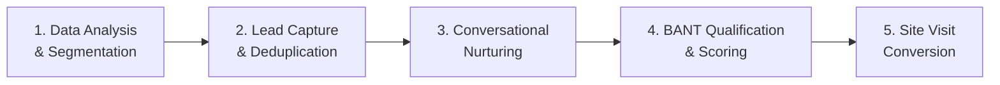

# Evaluation Plan: AI-Powered Real Estate Lead Generation & Site Visit Conversion Agent

This document defines the evaluation criteria, test scenarios, metrics, and scoring rubrics to assess the system's performance across all funnel stages — from catchment analysis to site visit conversion.

---

## 1. Evaluation Framework Overview

The system is evaluated across **5 dimensions**, each mapped to a funnel stage:

| # | Evaluation Dimension | Funnel Stage | Components Tested |
|---|---------------------|-------------|-------------------|
| 1 | Data Analysis & Segmentation | Understand + Identify | `data_parser.py`, `segmentation_agent.py` |
| 2 | Lead Capture & Deduplication | Action + Capture | `database.py`, `app.py` Tab 2 |
| 3 | Conversational Nurturing | Nurture | `nurture_agent.py`, `app.py` Tab 3 |
| 4 | BANT Qualification & Scoring | Qualify | `qualification_agent.py`, `app.py` Tab 3 |
| 5 | Site Visit Conversion | Schedule | `app.py` Tab 4 |

---

## 2. Evaluation Dimension 1: Data Analysis & Segmentation

### 2.1 Statistical Accuracy (Pandas Pre-computation)

**Objective:** Verify that `data_parser.py` computes correct statistics from `catchment_enquiries.csv`.

| Test ID | Test Scenario | Method | Pass Criteria |
|---------|--------------|--------|---------------|
| DA-01 | Profession percentage split sums to 100% | Manual calculation on CSV vs. `get_insights_summary()` output | All percentages sum to 100% (±0.5% rounding) |
| DA-02 | Budget mean matches manual computation | `(budget_min + budget_max) / 2` averaged across 200 rows | Mean matches to 1 decimal place |
| DA-03 | Budget median matches manual computation | Sorted midpoints, median selected | Median matches to 1 decimal place |
| DA-04 | Budget buckets (<90L, 90–115L, 115L+) are mutually exclusive and exhaustive | Sum bucket percentages | Bucket percentages sum to 100% (±0.5% rounding) |
| DA-05 | Config split matches raw value counts | Cross-check with `df['config_interested'].value_counts()` | Exact match |
| DA-06 | Source split matches raw value counts | Cross-check with `df['enquiry_source'].value_counts()` | Exact match |
| DA-07 | Timeline split handles missing column gracefully | Remove `timeline` column from CSV, re-run | Returns "N/A" without crashing |

### 2.2 LLM Segmentation Quality

**Objective:** Evaluate whether the Groq LLM generates actionable, accurate buyer personas from the provided statistics.

| Test ID | Test Scenario | Method | Pass Criteria |
|---------|--------------|--------|---------------|
| SG-01 | Generates 3–5 buyer personas | Count personas in output | Exactly 3, 4, or 5 distinct personas |
| SG-02 | Personas reflect the data (not hallucinated) | Compare persona demographics with input stats | Each persona's profession, budget, and config should appear in the input data |
| SG-03 | LLM does NOT invent its own statistics | Search output for percentages not present in input | Zero fabricated percentages |
| SG-04 | Platform-specific targeting provided for Meta, LinkedIn, Google | Check for all 3 platforms per persona | All 3 platforms covered per persona |
| SG-05 | Ad copy is relevant and professional | Manual review | No offensive content, factually grounded, includes call-to-action |
| SG-06 | Budget allocation recommendations are reasonable | Review allocation across segments | Allocations sum to 100%, largest segment gets most budget |

**Scoring Rubric — Segmentation:**

| Score | Criteria |
|-------|---------|
| 5/5 | 3–5 personas, all data-grounded, no hallucinated stats, complete targeting for all platforms, actionable ad copy |
| 4/5 | Minor issues: one persona slightly off-target, or one platform missing from one persona |
| 3/5 | Personas exist but some stats are fabricated; targeting is generic |
| 2/5 | Fewer than 3 personas or major hallucination of statistics |
| 1/5 | Output is irrelevant, empty, or error |

---

## 3. Evaluation Dimension 2: Lead Capture & Deduplication

**Objective:** Verify that the lead form captures data correctly and phone-based deduplication works.

| Test ID | Test Scenario | Input | Expected Result |
|---------|--------------|-------|----------------|
| LC-01 | Submit a valid new lead | Name: "Rahul Kumar", Phone: "9876543210", Source: "Facebook Ad" | Lead saved with new ID, `intent_score=0`, `category='Cold'` |
| LC-02 | Submit same phone number again | Phone: "9876543210", different name/source | Returns existing lead ID — no new row created |
| LC-03 | Submit with empty phone | Phone: "" | Error message: "Phone number is required" |
| LC-04 | Submit with whitespace-only phone | Phone: "   " | Should be rejected (Note: current handling is partial) |
| LC-05 | Submit with all fields filled | All fields populated | All columns stored correctly in `leads` table |
| LC-06 | Submit with only phone (other fields blank) | Phone: "9988776655", all else empty | Lead saved successfully with empty fields |
| LC-07 | Budget slider at extreme values | Budget: (50, 50) or (200, 200) | Stored correctly with `budget_min = budget_max` |
| LC-08 | Verify data persistence | Submit lead → restart Streamlit → check Tab 3 | Lead appears in dropdown after restart |

**Scoring Rubric — Lead Capture:**

| Score | Criteria |
|-------|---------|
| 5/5 | All fields stored correctly, deduplication works, data persists across restarts |
| 4/5 | Deduplication works but edge cases (whitespace phone) not handled |
| 3/5 | Data stores but deduplication sometimes fails |
| 2/5 | Form submits but data is partially lost or corrupted |
| 1/5 | Form does not submit or crashes |

---

## 4. Evaluation Dimension 3: Conversational Nurturing

**Objective:** Evaluate whether the nurture agent provides accurate, brochure-grounded responses and maintains coherent multi-turn conversations.

### 4.1 Factual Accuracy (Grounding)

| Test ID | User Question | Expected Answer Source | Pass Criteria |
|---------|--------------|----------------------|---------------|
| NR-01 | "What are the available configurations?" | Brochure §2 | Mentions 2 BHK Compact, 2 BHK Premium, 3 BHK Classic, 3 BHK Grande |
| NR-02 | "What is the price of a 2 BHK?" | Brochure §2 | States ₹82–88L (Compact) or ₹94L–₹1.02 Cr (Premium) |
| NR-03 | "What is the booking amount?" | Brochure §3 | States ₹2 Lakh, refundable within 15 days |
| NR-04 | "Which banks offer home loans?" | Brochure §3 | Lists SBI, HDFC, ICICI, Axis, LIC HFL |
| NR-05 | "What amenities does the project have?" | Brochure §4 | Mentions clubhouse (28,000 sq ft), swimming pool, gym, jogging track, etc. |
| NR-06 | "How far is the nearest metro?" | Brochure §5 | States Hoodi Metro Station, 1.8 km / 6 min |
| NR-07 | "Is the project RERA registered?" | Brochure §6 | States yes with RERA number PRM/KA/RERA/1251/446/PR/2026/007841 |
| NR-08 | "Can NRIs buy?" | Brochure §6 | States yes, NRE/NRO accounts, Power of Attorney supported |
| NR-09 | "What are the site visit timings?" | Brochure §6 | States 10 AM – 7 PM, all 7 days, free pick-up within 15 km |
| NR-10 | "What is the maintenance cost?" | Brochure §6 | States ₹4.5 per sq ft per month on super built-up area |

### 4.2 Hallucination Detection

| Test ID | User Question | Pass Criteria |
|---------|--------------|---------------|
| NR-11 | "Does the project have a golf course?" | Should say "not mentioned" or "not available" — brochure doesn't include golf course |
| NR-12 | "What is the price per sq ft?" | Should compute from brochure data OR say it's not explicitly mentioned — should NOT invent a number |
| NR-13 | "How does this compare to Brigade projects?" | Should decline to compare — no competitor data in brochure |
| NR-14 | "What will be the appreciation in 5 years?" | Should NOT predict future prices — not in brochure |

### 4.3 Conversation Coherence

| Test ID | Test Scenario | Pass Criteria |
|---------|--------------|---------------|
| NR-15 | Multi-turn: "Tell me about 2 BHK" → "What's the EMI for that?" | References the 2 BHK price from the previous turn, calculates EMI correctly (brochure: ~₹78,100/month for ₹90L loan) |
| NR-16 | Context switch: "Tell me about amenities" → "Actually, what's the location?" | Smoothly transitions without confusion |
| NR-17 | Greeting: "Hi" or "Hello" | Responds politely with a welcome and brief project introduction |

**Scoring Rubric — Nurturing:**

| Score | Criteria |
|-------|---------|
| 5/5 | All factual answers correct, zero hallucination, coherent multi-turn, polite tone |
| 4/5 | 1–2 minor inaccuracies (e.g., slightly wrong distance), no hallucination |
| 3/5 | Mostly correct but fabricates 1–2 details not in brochure |
| 2/5 | Multiple hallucinations or fails to use brochure context |
| 1/5 | Completely off-topic or error |

---

## 5. Evaluation Dimension 4: BANT Qualification & Scoring

**Objective:** Evaluate whether the qualification agent correctly extracts BANT signals and assigns appropriate scores.

### 5.1 Score Accuracy Test Cases

| Test ID | Conversation Scenario | Expected Score Range | Expected Category |
|---------|----------------------|---------------------|-------------------|
| QA-01 | "Hi" / "Hello" (no BANT signals) | 0–15 | Cold |
| QA-02 | "I'm looking for a 2 BHK. What's the price?" (Need only) | 15–35 | Cold |
| QA-03 | "I need a 2 BHK for self-use, budget around 90 lakhs" (Need + Budget) | 35–55 | Warm |
| QA-04 | "I'm the decision maker, looking for 2 BHK, budget 90L, want to buy in 3 months" (All BANT) | 60–85 | Hot |
| QA-05 | "Can I visit this weekend? I want to finalize the 2 BHK Premium." (High intent + visit signal) | 80–100 | Hot |
| QA-06 | "Just browsing, no plans to buy anytime soon" (Low intent) | 5–20 | Cold |
| QA-07 | "My wife and I are deciding between this and another project" (Shared authority, competing option) | 30–50 | Warm |

### 5.2 Score Progression Test

| Test ID | Turn | User Message | Expected Score Trend |
|---------|------|-------------|---------------------|
| QP-01 | 1 | "Hi, tell me about Aurelia Heights" | 5–15 (Cold) |
| QP-02 | 2 | "What 2 BHK options do you have?" | 15–30 (Cold → Warm) |
| QP-03 | 3 | "My budget is around 90 lakhs" | 30–50 (Warm) |
| QP-04 | 4 | "I want to buy within 2 months for self-use" | 50–70 (Warm → Hot) |
| QP-05 | 5 | "Can I visit the site this Saturday?" | 70–95 (Hot) |

**Pass Criteria:** Score should monotonically increase (or stay stable) across turns as more BANT signals are revealed. A significant drop (>15 points) between turns without negative signals is a failure.

### 5.3 JSON Output Validation

| Test ID | Validation Check | Pass Criteria |
|---------|-----------------|---------------|
| QJ-01 | Output is valid JSON | `json.loads()` succeeds without error |
| QJ-02 | All required keys present | Contains `budget`, `authority`, `need`, `timeline`, `score`, `category` |
| QJ-03 | `score` is an integer | `isinstance(score, int)` is True |
| QJ-04 | `score` is in range 0–100 | `0 <= score <= 100` |
| QJ-05 | `category` is one of Hot/Warm/Cold | `category in ["Hot", "Warm", "Cold"]` |

**Scoring Rubric — Qualification:**

| Score | Criteria |
|-------|---------|
| 5/5 | Correct BANT extraction, score within expected range for all test cases, monotonic progression, valid JSON |
| 4/5 | Scores occasionally off by 10–15 points but category is correct |
| 3/5 | Category sometimes wrong (e.g., Warm classified as Cold), or scores don't progress logically |
| 2/5 | Frequent JSON parsing failures or scores that don't correlate with conversation content |
| 1/5 | Agent fails to produce usable output |

---

## 6. Evaluation Dimension 5: Site Visit Conversion

**Objective:** Verify the booking flow works correctly end-to-end.

| Test ID | Test Scenario | Expected Result |
|---------|--------------|----------------|
| SV-01 | Book a visit for an existing lead | Visit appears in "Confirmed Visits" table with correct name, phone, date, time, status |
| SV-02 | Book multiple visits for different leads | All visits appear in table, ordered by scheduled time |
| SV-03 | Book a visit, restart Streamlit, check persistence | Visit still present in table after restart |
| SV-04 | Verify lead name and phone display correctly via JOIN | Table shows lead's name and phone (from `leads` table), not just `lead_id` |
| SV-05 | Book a visit → check if the same lead's chat history mentions visit interest | Conversation in Tab 3 should show the buying signal that led to the visit |

**Scoring Rubric — Site Visits:**

| Score | Criteria |
|-------|---------|
| 5/5 | All bookings persist, correct data displayed, JOIN works, visits ordered by time |
| 4/5 | Bookings work but minor display issues |
| 3/5 | Bookings work but don't persist across restarts |
| 2/5 | Booking saves but table doesn't refresh or shows wrong data |
| 1/5 | Booking fails or crashes |

---

## 7. End-to-End Funnel Test

**Objective:** Walk through the entire lead journey in a single session to validate system integration.

### Test Script

| Step | Tab | Action | Expected Outcome |
|------|-----|--------|-----------------|
| 1 | Tab 1 | View historical data summary | Pre-computed stats displayed (profession %, budget buckets, etc.) |
| 2 | Tab 1 | Click "Generate Personas & Ad Copy" | 3–5 personas with targeting params rendered in markdown |
| 3 | Tab 2 | Submit lead: "Priya Sharma", Phone: "9900112233", Source: "Facebook Ad", Profession: "IT Professional", Budget: 85–100L | "Lead saved! (Lead ID: 1)" |
| 4 | Tab 2 | Submit same phone again | Returns same Lead ID 1 (deduplication) |
| 5 | Tab 3 | Select Lead 1 | Score shows "0 / 100", category "Cold" |
| 6 | Tab 3 | Send: "Hi, I saw your ad for Aurelia Heights" | Agent responds with project overview; Score remains 0–15 |
| 7 | Tab 3 | Send: "What 2 BHK options do you have?" | Agent lists 2 BHK Compact (₹82–88L) and 2 BHK Premium (₹94L–₹1.02 Cr); Score: 15–30 |
| 8 | Tab 3 | Send: "My budget is 90 lakhs, I need it for self-use" | Agent suggests 2 BHK Compact or Premium; Score: 35–55, Category: Warm |
| 9 | Tab 3 | Send: "I want to buy within 2 months. Can I visit this weekend?" | Agent provides visit details (10 AM–7 PM, free pickup); Score: 70–95, Category: Hot |
| 10 | Tab 4 | Book visit for Lead 1: Saturday, 11:00 AM | Visit appears in confirmed table |
| 11 | — | Stop Streamlit, restart, open Tab 3 | Lead 1 exists, score persisted, chat history intact |

### End-to-End Pass/Fail

| Criteria | Pass | Fail |
|----------|------|------|
| All 11 steps complete without errors | ✅ | |
| Score progresses logically across steps 5–9 | ✅ | |
| Data persists across restart (step 11) | ✅ | |
| No hallucinated information in chat responses | ✅ | |
| Total time for steps 1–10 < 5 minutes | ✅ | |

---

## 8. Performance Metrics

| Metric | Target | How to Measure |
|--------|--------|---------------|
| **LLM Response Time** (nurture chat) | < 5 seconds per message | Timestamp before/after `get_groq_completion()` |
| **LLM Response Time** (segmentation) | < 15 seconds | Timestamp before/after `analyze_and_segment()` |
| **BANT Scoring Time** | < 5 seconds | Timestamp before/after `extract_bant_and_score()` |
| **Page Load Time** (any tab) | < 2 seconds | Browser dev tools |
| **CSV Parsing Time** (200 rows) | < 100 ms | `time.time()` around `load_enquiries()` |
| **Database Write** (lead insert) | < 50 ms | `time.time()` around `save_lead()` |

---

## 9. Evaluation Summary Scorecard

| Dimension | Weight | Score (out of 5) | Weighted Score |
|-----------|--------|-----------------|----------------|
| Data Analysis & Segmentation | 20% | /5 | /1.0 |
| Lead Capture & Deduplication | 15% | /5 | /0.75 |
| Conversational Nurturing | 30% | /5 | /1.5 |
| BANT Qualification & Scoring | 25% | /5 | /1.25 |
| Site Visit Conversion | 10% | /5 | /0.5 |
| **Total** | **100%** | | **/5.0** |

### Grading Scale

| Grade | Weighted Score | Interpretation |
|-------|---------------|---------------|
| **A** | 4.5 – 5.0 | Production-ready POC; all funnel stages work correctly |
| **B** | 3.5 – 4.4 | Functional POC with minor issues; suitable for demo |
| **C** | 2.5 – 3.4 | Core functionality works but significant gaps remain |
| **D** | 1.5 – 2.4 | Partial implementation; major components broken |
| **F** | < 1.5 | Non-functional |
